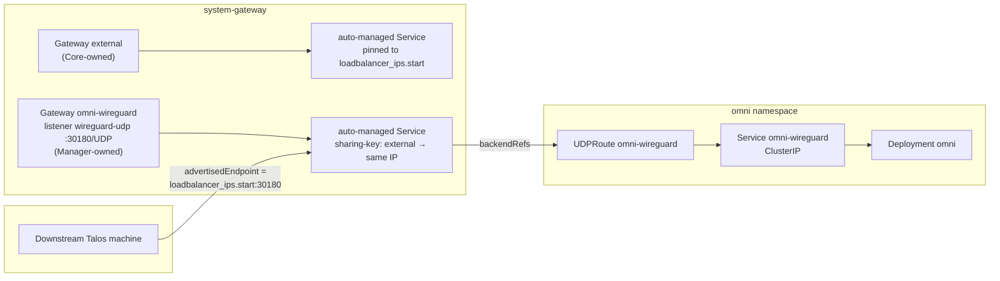

# ADR-0005: SideroLink WireGuard exposure — a dedicated Gateway sharing the shared gateway's IP

## Status

Accepted (2026-08-08), implemented for the `cilium` gateway driver. Supersedes
[ADR-0004](0004-omni.md) decision 5 for that case. NodePort environments (docker-desktop by
default) and the `envoy` driver keep decision 5's original dedicated-Service design — see
Decision 2 and 3 for why.

## Context

ADR-0004 decision 5 gave SideroLink's WireGuard tunnel its own `NodePort`/`LoadBalancer`
Service, reasoning that raw UDP "isn't proxied traffic the gateway can front." That's true of
`HTTPRoute` — WireGuard is neither HTTP nor TLS-SNI-routable — but Gateway API also defines
`UDPRoute` (experimental channel), and Core already runs a live example of exactly this shape:
CoreDNS's own UDP/53 listener, routed through Envoy Gateway.

**Cilium added native `UDPRoute` support in 1.20** — the version pinned in
`kustomize/cni/install/cilium/helm-release.yaml`. Verified live: `kubectl get gatewayclass
cilium -o jsonpath='{.status.supportedFeatures[*].name}'` lists `UDPRoute`;
`kubeProxyReplacement: true` and `enable-l7-proxy: true` (both required) were already active.

**The gateway's own address is statically known for local/on-prem platforms — the real
payoff, not just consolidation.** Cilium's `lbipam.cilium.io/ips` annotation pins the shared
gateway's Service to `network.loadbalancer_ips.start`, computed purely from
`network.cidr_block` — no apply needed to discover it. Omni's own chart-managed
`LoadBalancer` Service, by contrast, gets an *arbitrary* IP from the same pool, which is what
forced the two-phase "apply once, then set the real IP" bootstrap ADR-0004 decision 5
accepted.

## Decision

**1. On the `cilium` driver, Omni gets its own dedicated `Gateway` object
(`omni-wireguard`), sharing the shared gateway's external IP via Cilium's LB-IPAM
`sharing-key` — not a listener added to the shared `Gateway` object itself.**

Two independent Kustomizations both applying the shared `Gateway/external` object was tried
first and rejected: Flux's `kustomize-controller` uses **one field-manager identity for every
Kustomization**, not one per Kustomization, and its default SSA policy is `Override` (prune
whatever the current apply doesn't declare) — confirmed both from Flux's own docs and by a
real CI failure where `gateway-resources` (Core's own Kustomization) and `omni-resources`
(Manager's) fought over `spec.listeners` on every reconcile and neither ever stabilized.
Merging into Core's own `gateway` Kustomization by declaring a second `flux:` block with the
same name was tried next and also rejected: Windsor's blueprint composer merges the
`components:` list across facets, but the merged Kustomization keeps only *one* `Path`/
`Source` — Manager's component path then resolves against Core's OCI-fetched tree, where it
doesn't exist. Neither approach is architecturally supported the way this ADR needs.

A wholly separate `Gateway` object, owned solely by Manager's own `omni-resources`
Kustomization, sidesteps both problems — nothing else ever touches it. `sharing-key`
(verified live for the `ips` annotation propagating from a Gateway's `infrastructure.
annotations` to its auto-generated Service; the Service-level sharing mechanics beyond that
are documented but not independently verified in this repo) reuses the shared gateway's
address instead of allocating a new one.

**2. `envoy` driver keeps the original dedicated-Service design (`omni/loadbalancer`
component).** No Envoy Gateway equivalent of `sharing-key` was investigated for this pass —
plain LoadBalancer/NodePort Services, same as ADR-0004 originally shipped. The LB-IP
bootstrap gap (dev-mode placeholder, or the two-phase apply-then-set dance) still applies
here, same as before this ADR.

**3. NodePort environments (docker-desktop by default) keep the original dedicated-Service
design too (`omni/nodeport` component)**, regardless of gateway driver — SideroLink isn't
routed through the gateway there either.

**4. One port, three roles, single source of truth.** `omni.wireguard.node_port` (default
`30180`) serves as the dedicated Gateway's listener port, the chart's own Service port
(`ClusterIP` case) or NodePort (`NodePort` case), and the `UDPRoute` `backendRefs` port.

## Consequences

- **The LB-IP bootstrap problem is eliminated on the `cilium` driver** — confirmed live:
  `omni_wireguard_advertised_endpoint` derives a real address with zero operator input,
  immediately after `windsor init`, before any apply.
- **Split three ways now**: cilium (gateway-routed), envoy (dedicated Service), NodePort
  (dedicated Service) — a real fork, wider than a single driver/mode split, in exchange for
  not shipping the unverified cross-Kustomization risk.
- **`sharing-key` across two `Gateway` objects (not just Services) is inferred, not
  independently verified in this repo** — Cilium's own docs describe it at the Service level;
  I confirmed the `ips` annotation itself propagates from a Gateway's `infrastructure.
  annotations` to its generated Service, and LB-IPAM operates on Services regardless of what
  created them, but haven't watched two Gateway-generated Services actually converge on one
  IP end to end. If it doesn't work as expected, `omni-wireguard` gets its own separate IP
  instead of sharing one — the Gateway still reconciles fine, just with a wrong advertised
  address, not a hang.
- **WireGuard's session/handshake behavior is unaffected** — Cilium's UDP proxying is
  stateless L4 passthrough per-5-tuple, equivalent to a NodePort's kube-proxy path. A real
  handshake through the gateway-routed path is not yet proven end to end (see Open questions).

## Alternatives considered

**Add a listener to the shared `Gateway` object from a separate Kustomization.** Rejected —
Flux's single global field-manager identity means two Kustomizations both applying the same
object fight over `spec.listeners` ownership every reconcile. Confirmed via a real CI failure.

**Merge into Core's own `gateway` Kustomization via a same-named `flux:` block.** Rejected —
Windsor's composer merges `components:` lists across facets but not `Path`/`Source`; Manager's
component path then resolves against Core's tree, where it doesn't exist. Confirmed via a
real CI failure (`kustomize build failed: ... no such file or directory`).

**Route NodePort and envoy through the gateway too.** Deferred, not rejected outright — no
Cilium-analog `sharing-key` mechanism was investigated for Envoy Gateway, and NodePort mode
never routes through the gateway regardless of driver in this design. Real follow-up.

**Leave ADR-0004 decision 5 as-is for every case.** Rejected for `cilium` once the LB-IP
bootstrap elimination was confirmed live — a strictly better outcome for the common case.
Still the answer for `envoy` and NodePort.

## Open questions

- Real end-to-end validation of a device joining through the gateway-routed path. Protocol-
  level wiring is verified live (listener/`UDPRoute` `Accepted`/`Programmed`, Cilium's Service
  picking up the port, Omni's advertised endpoint correct after a real SAML login) — a real
  WireGuard handshake is not. `tests/omni/register-machine.sh`'s colima path was investigated
  and hit a confirmed platform wall (see its README): colima's cluster and its QEMU VM each
  get an isolated `vmnet-shared` segment that `vmnet.framework` won't route between, confirmed
  via `tcpdump`. The path forward is a WireGuard test client running as a Pod inside the
  cluster, sidestepping cross-VM routing — not attempted here.
- Whether `sharing-key` genuinely converges two `Gateway`-generated Services onto one IP in
  practice, not just by inference from the Service-level docs.
- Whether `envoy` or NodePort can move onto a gateway-routed design too, and what the
  Envoy-Gateway-native equivalent of `sharing-key` (if any) would be.
- Real latency/throughput comparison, gateway-proxied vs. direct — not measured.
