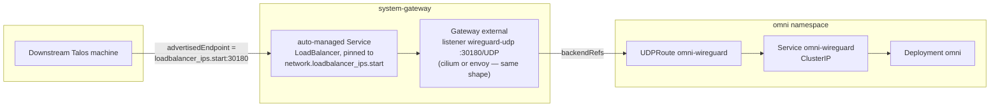

# ADR-0005: SideroLink WireGuard exposure — routing through the shared gateway

## Status

Accepted (2026-08-08), implemented for LoadBalancer-capable environments on both gateway
drivers. Supersedes [ADR-0004](0004-omni.md) decision 5 for that case. NodePort environments
(docker-desktop by default, or an explicit `gateway.service_type: NodePort` override) keep
decision 5's original dedicated-Service design unchanged — see "NodePort stays on the old
path" below for why.

## Context

ADR-0004 decision 5 gave SideroLink's WireGuard tunnel its own `NodePort`/`LoadBalancer`
Service, reasoning that raw UDP "isn't proxied traffic the gateway can front." That's true of
`HTTPRoute` — WireGuard is neither HTTP nor TLS-SNI-routable — but Gateway API also defines
`UDPRoute` (experimental channel), and Core already runs a live example of exactly this
shape: CoreDNS's own UDP/53 listener, routed through Envoy Gateway.

**Cilium added native `UDPRoute` support in 1.20** — the version pinned in
`kustomize/cni/install/cilium/helm-release.yaml` — closing the gap that made this envoy-only
when this ADR was first drafted. Verified live against a running cluster on the `cilium`
driver: `kubectl get gatewayclass cilium -o jsonpath='{.status.supportedFeatures[*].name}'`
lists `UDPRoute`; `kubeProxyReplacement: true` and `enable-l7-proxy: true` (both required)
were already active; `gateway-api-hostnetwork-enabled: "false"` (the one documented
incompatibility — host-network-mode Gateways bypass Envoy/the L7 proxy for `TCPRoute`/
`UDPRoute`) doesn't apply here.

**The gateway's own address is statically known for local/on-prem LoadBalancer platforms —
this is the real payoff, not just consolidation.** Cilium's `lbipam.cilium.io/ips` annotation
and Envoy's `loadBalancerIP` both pin the gateway's Service to `network.loadbalancer_ips.start`,
computed purely from `network.cidr_block` — no apply needed to discover it. Omni's own
chart-managed `LoadBalancer` Service, by contrast, gets an *arbitrary* IP from the same pool,
which is what forced the two-phase "apply once, then set the real IP" bootstrap ADR-0004
decision 5 accepted. Routing through the gateway eliminates that bootstrap gap for local/on-prem
platforms — not just relocates it. Only genuine cloud-managed LB controllers (aws, hetzner,
azure) keep the "unknown until Service exists" problem, same as `gateway_dns_target` already has.

## Decision

**1. LoadBalancer-capable environments (both gateway drivers) route SideroLink through the
shared gateway.** `kustomize/omni/resources/omni/gateway/wireguard/` adds a dedicated
`wireguard-udp` listener to the shared Gateway and a `UDPRoute` backed by Omni's own
(now `ClusterIP`) Service — the same shape CoreDNS already proves, generalized to both
drivers since Cilium's support is native, no envoy-specific plumbing required on that side.

The Gateway listener is a standalone partial resource (`gateway-listener.yaml`), not a
kustomize `patches:` block — a patch target must be present in the same kustomize build, and
the Core-owned shared Gateway lives in Core's own `gateway-resources` Kustomization instead.
Server-side apply composes this: `spec.listeners` is an SSA-associative list keyed by `name`,
so this field manager's contribution merges alongside `gateway-resources`' own listeners —
verified live (both survive; Cilium's Service picked up the new port immediately,
`Accepted`/`ResolvedRefs`/`Programmed` all `True`).

**2. NodePort stays on the old path — not routed through the gateway.** Publishing an extra
NodePort on the gateway's own Service means patching Core's shared `EnvoyProxy` object's
`spec.provider.kubernetes.envoyService.patch` — an opaque JSON blob, not a typed/SSA-associative
list the way `spec.listeners` is. Core's own `nodeport/dns` component gets away with patching
this field only because it composes inside `gateway-resources`' own single kustomize build;
Manager's `omni-resources` Kustomization is a separate Flux object, and whether SSA merges that
opaque field safely across independent field managers wasn't verified. Rather than ship that
risk, `kustomize/omni/install/omni/nodeport/` keeps the original dedicated-`NodePort`-Service
design, included whenever `lb_effective.mode == 'nodeport'` (docker-desktop by default).
`wireguard_advertised_endpoint`'s NodePort derivation is unchanged from ADR-0004.

**3. One port, three roles, single source of truth.** `omni.wireguard.node_port` (default
`30180`) now serves as the gateway listener's port, the chart's own Service port (`ClusterIP`
case) or NodePort (`NodePort` case), and the `UDPRoute` `backendRefs` port — one
substitution, no drift between them.

## Consequences

- **The LB-IP bootstrap problem is eliminated for local/on-prem platforms**, not merely
  relocated — confirmed live: `omni_wireguard_advertised_endpoint` derives a real address with
  zero operator input, immediately after `windsor init`, before any apply.
- **One external entry point for everything Omni exposes** on LoadBalancer-capable
  environments, matching the direction ADR-0004 decision 4 already took Omni's HTTP/gRPC
  traffic.
- **A permanent NodePort/LoadBalancer code fork remains**, deliberately — narrower than the
  original design's fork (no longer split by gateway driver too), but not gone.
- **WireGuard's session/handshake behavior is unaffected** — Envoy's and Cilium's UDP
  proxying is stateless L4 passthrough per-5-tuple, equivalent to a NodePort's kube-proxy
  path. A real handshake through the gateway-routed path is not yet proven end to end (see
  Open questions) — worth doing before relying on this for a real fleet.

## Alternatives considered

**Route the NodePort case through the gateway too**, via a cross-Kustomization patch to the
shared EnvoyProxy. Rejected for this pass as an unverified SSA-conflict risk — worth
revisiting once tested against a live envoy-driver cluster with `nodeport/dns` simultaneously
active. Named follow-up, not dropped.

**Force `gateway.driver: envoy` everywhere**, on the now-outdated assumption only `envoy`
could do this. No longer relevant — Cilium's support is native.

**Leave ADR-0004 decision 5 as-is.** Rejected once the LB-IP bootstrap elimination was
confirmed live — a strictly better outcome for the common case.

## Open questions

- Real end-to-end validation of a device joining through the gateway-routed path. Protocol-
  level wiring is verified live (listener/`UDPRoute` `Accepted`/`Programmed`, Cilium's Service
  picking up the port, Omni's advertised endpoint correct after a real SAML login) — a real
  WireGuard handshake is not. `tests/omni/register-machine.sh`'s colima path was investigated
  and hit a confirmed platform wall (see its README): colima's cluster and its QEMU VM each
  get an isolated `vmnet-shared` segment that `vmnet.framework` won't route between, confirmed
  via `tcpdump`. The path forward is a WireGuard test client running as a Pod inside the
  cluster, sidestepping cross-VM routing — not attempted here.
- Whether the NodePort case can safely move onto the gateway-routed path, pending the
  cross-Kustomization SSA-conflict question above.
- Real latency/throughput comparison, gateway-proxied vs. direct — not measured.
