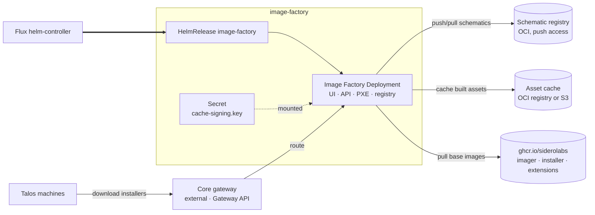

# Image-factory

Generates Talos boot assets — installers, ISOs, PXE artifacts — from schematics, the same
service that runs at [factory.talos.dev](https://factory.talos.dev), hosted in the
management cluster. A fleet needs this to pin what its machines boot and to build images
with system extensions without reaching the public factory.

The add-on installs the Sidero Labs `image-factory` chart from
`oci://ghcr.io/siderolabs/charts`. It has two hard external dependencies that are not
optional and not defaulted:

- **A schematic registry.** Generated schematics are pushed to an OCI registry, so the
  factory needs one it can write to. Once Manager's Harbor lands this points at it; until
  then it is whatever registry the operator supplies. The chart's `registry.example.com`
  is a placeholder that fails at runtime, so the facet requires the value up front.
- **A cache signing key.** Cached assets are signed so nodes can verify what they receive.
  The `keys/signing` Terraform module generates an ECDSA P-256 key and holds it in state;
  set `cache_signing_key` to supply your own instead, and the module is skipped. Windsor
  materializes whichever it gets into the `image-factory-cache-signing-key` Secret, where
  the chart reads the data key `cache-signing.key`.

  Rotating the key invalidates every asset already signed with the old one.

## Architecture



## Routing

The factory is reachable at `factory.<domain>` through Core's canonical `external` Gateway.
The add-on ships one HTTPRoute attached to both the `web-http` and `web-https` listeners,
which covers the envoy and cilium drivers alike — both implement Gateway API, and Core emits
the same Gateway either way. The route lives in the resources tier and waits on
`gateway-resources`, so the listeners exist before it attaches.

## Scaling

Builds are CPU-bound and each one runs the imager. Three levers, in the order worth
reaching for them:

1. **Cache.** The default OCI cache means an asset is built once and served thereafter.
   Switching `cache.driver` to `s3` moves that to a bucket, which pairs with Core's object
   store addon. Running with no working cache is what makes a factory feel slow.
2. **Concurrency.** `max_concurrency` (default 6) caps simultaneous builds. Raising it
   without node capacity converts one slow build into six slow builds.
3. **Replicas.** `topology: ha` runs two replicas with anti-affinity. The chart pins the
   Recreate strategy, so this buys redundancy against node loss, not zero-downtime
   rollouts. Replicas are safe because nothing is held locally — schematics are in the
   registry, assets in the cache.

## Configuration

<!-- BEGIN_KUSTOMIZE_DOCS -->

## Substitutions

| Name | Required when | Effect |
|---|---|---|
| `external_domain` | always | Domain the factory is served under; the hostname is `factory.<external_domain>`. Public domain when set, otherwise the private domain or the cluster domain. |
| `factory_schematic_registry` | always | OCI registry the factory pushes generated schematics to. Needs push access; the chart's `registry.example.com` is a placeholder, not a working default. |
| `factory_schematic_namespace` | optional | Repository path prefix for schematics. Defaults to `siderolabs/image-factory`. |
| `factory_schematic_repository` | optional | Repository name for schematics. Defaults to `schematics`. |
| `factory_schematic_insecure` | optional | Allow HTTP or invalid TLS to the schematic registry. Defaults to `false`. |
| `factory_max_concurrency` | optional | Simultaneous asset builds. Defaults to `6`; each build is CPU-bound, so raise it with the node pool rather than ahead of it. |
| `factory_min_talos_version` | optional | Oldest Talos release assets are generated for. Defaults to `1.2.0`. |

## Components

| Component | Enable when | Effect |
|---|---|---|
| `registry` | no external schematic registry is named | In-cluster OCI registry (`distribution`) holding schematics and cached boot assets. Reached at `registry.image-factory.svc.cluster.local:5000` over plain HTTP; no route, and a NetworkPolicy admits only the factory pod on 5000. |
| `registry/pvc` | the platform has no object storage | Backs the registry with a PersistentVolumeClaim on the default storage class. Without it the registry is an emptyDir, and a restart loses every schematic id already handed out. |
| `registry/s3` | the platform has object storage | Backs the registry with a bucket from the object store instead of a volume. |
| `image-factory` | `addons.image_factory.enabled == true` | Helm release of the Sidero Labs `image-factory` chart in `image-factory`, from `oci://ghcr.io/siderolabs/charts`. Serves the UI, API, and registry frontends on :8080. Runs as uid 1000, non-root, baseline PSA-compatible. The chart supports only the Recreate deployment strategy. |
| `image-factory/ha` | `topology == 'ha'` | Two replicas with pod anti-affinity across nodes. Redundancy against node loss only — the Recreate strategy means rollouts still have a gap. Safe because builds are stateless: schematics live in the registry, cached assets in the cache backend. |
| `image-factory/prometheus` | `telemetry.metrics.enabled == true` | Metrics Service on :2122 plus a ServiceMonitor. Both are needed — the chart leaves the metrics Service off by default, so a ServiceMonitor alone would have nothing to scrape. |
| `image-factory/gateway` | gateway is enabled | HTTPRoute on Core's canonical `external` Gateway, attached to both the web-http and web-https listeners. One route serves both gateway drivers, since envoy and cilium each implement Gateway API. Lives in the resources tier and depends on `gateway-resources`. |

## Dependencies

| Add-on | Required when | Reason |
|---|---|---|
| `pki` | always | The factory is served over TLS, and the certificate is issued by the cluster issuer cert-manager installs. |
| `gateway` | `gateway.enabled == true` | The route CRDs have to exist before the chart renders an Ingress or HTTPRoute. |
| `object-store` | `addons.image_factory.cache.driver == 's3'` | The S3 cache backend needs a bucket. Core's object store addon provides the in-cluster MinIO that backs it. |

<!-- END_KUSTOMIZE_DOCS -->

## Recipes

Minimal, using the public registries for base images and an internal registry for
schematics:

```yaml
addons:
  image_factory:
    enabled: true
    host: factory.example.com
    cache_signing_key: ${secret("Developer", "image-factory", "cache_signing_key")}
    registry:
      schematic:
        registry: registry.example.com
```

Backed by Core's object store, with metrics and redundancy:

```yaml
topology: ha
telemetry:
  metrics:
    enabled: true
addons:
  object_store:
    enabled: true
  image_factory:
    enabled: true
    host: factory.example.com
    cache_signing_key: ${secret("Developer", "image-factory", "cache_signing_key")}
    registry:
      schematic:
        registry: registry.example.com
    cache:
      driver: s3
      endpoint: https://minio.system-object-store.svc:9000
      bucket: image-factory
```

## Not covered yet

- **PXE.** The chart exposes a separate PXE frontend with its own hostname
  (`ingress.pxe` / `gatewayApi.pxe`). Wiring it needs a second host and a decision about
  whether PXE is reachable from the provisioning network rather than the gateway.
- **SecureBoot.** Asset signing for SecureBoot needs a signing key, a certificate, and a
  PCR key, or a KMS backend. That is its own set of decisions about key custody.
- **Air-gapped.** Running without reaching `ghcr.io` means seeding base images and cosign
  material into an internal registry first, which is Harbor's problem before it is this
  add-on's.
