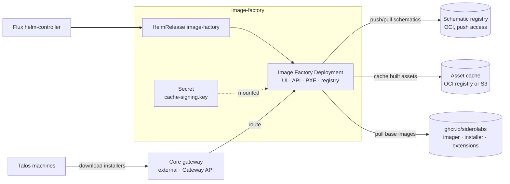

# Provisioning

Everything a fleet needs to provision and manage downstream Talos clusters: the
**image factory** that builds the boot assets those clusters install from, and **Omni**,
the control plane that provisions and manages the clusters themselves. Both are declared
in one facet, `addon-provisioning.yaml`, but each is its own Flux Kustomization and
independently toggleable — the `provisioning.enabled` flag is what turns them on together
as one fleet capability, fanning on `identity` and `provisioning.image_factory` as Omni's
dependencies. `provisioning.image_factory.enabled` alone still works without Omni or
`provisioning.enabled`, for a single cluster that only wants air-gapped, version-pinned
Talos assets.

## Image Factory

Generates Talos boot assets — installers, ISOs, PXE artifacts — from schematics, the same
service that runs at [factory.talos.dev](https://factory.talos.dev), hosted in the
management cluster. A fleet needs this to pin what its machines boot and to build images
with system extensions without reaching the public factory.

Installs the Sidero Labs `image-factory` chart from `oci://ghcr.io/siderolabs/charts`. It
has two hard external dependencies that are not optional and not defaulted:

- **A schematic registry.** Generated schematics are pushed to an OCI registry, so the
  factory needs one it can write to. Once Manager's Harbor lands this points at it; until
  then it is whatever registry the operator supplies. The chart's `registry.example.com`
  is a placeholder that fails at runtime, so the facet requires the value up front.
- **A cache signing key.** Cached assets are signed so nodes can verify what they receive.
  The `keys/signing` Terraform module generates an ECDSA P-256 key and holds it in state;
  set `cache_signing_key` to supply your own instead, and the module is skipped. Windsor
  materializes whichever it gets into the `image-factory-cache-signing-key` Secret, where
  the chart reads the data key `cache-signing.key`.

  Rotating the key invalidates every asset already signed with the old one.

### Architecture



### Routing

The factory is reachable at `factory.<domain>` through Core's canonical `external` Gateway.
The add-on ships one HTTPRoute attached to both the `web-http` and `web-https` listeners,
which covers the envoy and cilium drivers alike — both implement Gateway API, and Core emits
the same Gateway either way. The route lives in the resources tier and waits on
`gateway-resources`, so the listeners exist before it attaches.

### Scaling

Builds are CPU-bound and each one runs the imager. Three levers, in the order worth
reaching for them:

1. **Cache.** Assets are cached in the registry, so one is built once and served
   thereafter. On `hetzner` and `aws` that registry is bucket-backed and the cache
   survives the pod; elsewhere it lands on a PVC. Running with no working cache is what
   makes a factory feel slow.
2. **Concurrency.** `max_concurrency` (default 6) caps simultaneous builds. Raising it
   without node capacity converts one slow build into six slow builds.
3. **Replicas.** `topology: ha` runs two replicas with anti-affinity. The chart pins the
   Recreate strategy, so this buys redundancy against node loss, not zero-downtime
   rollouts. Replicas are safe because nothing is held locally — schematics are in the
   registry, assets in the cache.

## Omni

Sidero Labs' self-hosted fleet control plane for Talos — the system of record for every
downstream cluster's identity, and the thing an operator actually drives to provision and
manage them. See [ADR-0004](/docs/adr/0004-omni.md) for the deployment shape decisions:
embedded etcd, own TLS, WireGuard-based SideroLink exposure, and SAML auth against Core's
Keycloak realm rather than the OIDC path Omni's own group/role claim mapping doesn't support
yet.

Installs the Sidero Labs `omni` chart from `oci://ghcr.io/siderolabs/charts`. Hard external
dependencies:

- **An identity provider.** Omni authenticates operators via SAML, registered as a client
  of Core's platform Keycloak realm by an admin-API Job (`omni/saml-client`) — Core's
  `identity` add-on never enables the CRD-based client registration path.
- **An etcd encryption key** outside dev mode, and **at least one bootstrap admin email** —
  the chart refuses to start without either. See `provisioning.omni.etcd_encryption_key` and
  `provisioning.omni.initial_admins`.
- **A gateway.** Omni's UI/API, Kubernetes proxy, and SideroLink machine API are all
  reached through Core's canonical `external` Gateway.

### Routing

Three HTTPRoutes on the shared gateway — API/UI, Kubernetes proxy, and SideroLink machine
API — plus SideroLink's own WireGuard exposure, which varies by load-balancer mode: a
dedicated NodePort or LoadBalancer Service everywhere the gateway driver is envoy or the
cluster runs in NodePort mode, or a second Gateway sharing the shared one's external IP
(`omni/gateway/wireguard`) when the driver is cilium — see
[ADR-0005](/docs/adr/0005-siderolink-gateway-exposure.md) for why envoy doesn't get that
same dedicated-Gateway path yet.

### Image factory integration

Omni's `config.registries.imageFactoryBaseURL` points at Manager's own image factory when
`provisioning.image_factory.enabled == true`, falling back to the public `https://factory.talos.dev`
otherwise — both Omni's own reconciliation and the download links it hands back to an
operator's browser use this same URL.

## Configuration

<!-- BEGIN_KUSTOMIZE_DOCS -->

## Substitutions

| Name | Required when | Effect |
|---|---|---|
| `external_domain` | always | Domain the factory is served under; the hostname is `factory.<external_domain>`. Public domain when set, otherwise the private domain or the cluster domain. |
| `factory_schematic_registry` | always | OCI registry the factory pushes generated schematics to. Needs push access; the chart's `registry.example.com` is a placeholder, not a working default. |
| `factory_schematic_namespace` | optional | Repository path prefix for schematics. Defaults to `siderolabs/image-factory`. |
| `factory_schematic_repository` | optional | Repository name for schematics. Defaults to `schematics`. |
| `factory_schematic_insecure` | optional | Allow HTTP or invalid TLS to the schematic registry. Defaults to `false`. |
| `factory_max_concurrency` | optional | Simultaneous asset builds. Defaults to `6`; each build is CPU-bound, so raise it with the node pool rather than ahead of it. |
| `factory_min_talos_version` | optional | Oldest Talos release assets are generated for. Defaults to `1.2.0`. |
| `registry_bucket` | `registry/s3` | Bucket backing the in-cluster registry. Built from `object_store.prefix`, the same expression that names the bucket the object-store Terraform module provisions. |
| `registry_region` | `registry/s3` | Region embedded in the S3 v4 signature, from `object_store.region` — the Hetzner object storage location, or the AWS region. |
| `registry_endpoint` | `registry/s3` | S3 endpoint the registry writes to, from `object_store.endpoint`. |
| `registry_storage_class` | `registry/pvc` | Storage class for the registry volume. Defaults to `cluster.storage.class`, or `single`. |
| `registry_storage_size` | `registry/pvc` | Size of the registry volume. Defaults to `10Gi`. |
| `registry_replicas` | optional | Registry replicas. Two on `topology: ha` where a bucket backs it, otherwise one — a PVC cannot be shared across replicas. |
| `omni_account_id` | always | UUID for `config.account.id`, from `provisioning.omni.account_id` or the `omni-account` Terraform module's state. |
| `omni_hostname` | always | Base hostname Omni's UI/API advertises, from `provisioning.omni.hostname` or derived as `omni.<domain>`. |
| `omni_persistence_size` | always | Size of the volume backing Omni's embedded etcd, secondary SQLite storage, and machine logs. Defaults to `16Gi`. |
| `omni_wireguard_node_port` | `omni/nodeport` | NodePort for the WireGuard Service backing SideroLink. Chart default 30180. |
| `omni_wireguard_advertised_endpoint` | always | host:port machines dial for SideroLink, from `provisioning.omni.wireguard.advertised_endpoint` or derived from the compute module / cluster nodes. |
| `omni_initial_admins` | outside dev mode | Emails seeded as admins on Omni's first start, from `provisioning.omni.initial_admins`. |
| `keycloak_saml_url` | always | Identity's SAML descriptor URL Omni's chart fetches server-side at startup. |
| `keycloak_realm` | always | Identity realm Omni's SAML client registers against. |

## Components — `image-factory`

| Component | Enable when | Effect |
|---|---|---|
| `registry` | no external schematic registry is named | In-cluster OCI registry (`distribution`) holding schematics and cached boot assets. Reached at `registry.provisioning.svc.cluster.local:5000` over plain HTTP; no route, and a NetworkPolicy admits only the factory pod on 5000. |
| `registry/pvc` | `object_store.driver` is neither `hetzner` nor `aws` | Backs the registry with a PersistentVolumeClaim on the default storage class. Without it the registry is an emptyDir, and a restart loses every schematic id already handed out. |
| `registry/s3` | `object_store.driver` is `hetzner` or `aws` | Backs the registry with a bucket from the platform's object store instead of a volume. Limited to the platforms the registry holds credentials for: Hetzner keys come from `hetzner.object_storage`, and on AWS an empty key pair leaves the S3 driver on the instance credential chain. A minio object store stays on a PVC until credentials for one exist. |
| `image-factory` | `provisioning.image_factory.enabled == true` | Helm release of the Sidero Labs `image-factory` chart in `provisioning`, from `oci://ghcr.io/siderolabs/charts`. Serves the UI, API, and registry frontends on :8080. Runs as uid 1000, non-root, baseline PSA-compatible. The chart supports only the Recreate deployment strategy. |
| `image-factory/ha` | `topology == 'ha'` | Two replicas with pod anti-affinity across nodes. Redundancy against node loss only — the Recreate strategy means rollouts still have a gap. Safe because builds are stateless: schematics live in the registry, cached assets in the cache backend. |
| `image-factory/prometheus` | `telemetry.metrics.enabled == true` | Metrics Service on :2122 plus a ServiceMonitor. Both are needed — the chart leaves the metrics Service off by default, so a ServiceMonitor alone would have nothing to scrape. |
| `image-factory/gateway` | gateway is enabled | HTTPRoute on Core's canonical `external` Gateway, attached to both the web-http and web-https listeners. One route serves both gateway drivers, since envoy and cilium each implement Gateway API. Lives in the resources tier and depends on `gateway-resources`. |

## Components — `omni`

| Component | Enable when | Effect |
|---|---|---|
| `omni` | `provisioning.enabled == true` | Helm release of the Sidero Labs `omni` chart in `provisioning`, from `oci://ghcr.io/siderolabs/charts`. The fleet's self-hosted Talos control plane — embedded etcd, own TLS, SideroLink, Keycloak SAML. |
| `omni/saml-client` | always | Job that registers Omni as a SAML client of the platform Keycloak realm over the admin REST API. |
| `omni/prometheus` | `telemetry.metrics.enabled == true` | Metrics Service and ServiceMonitor for Omni's native metrics. |
| `omni/nodeport` | NodePort load-balancer mode (e.g. docker-desktop) | Dedicated NodePort Service for SideroLink WireGuard. |
| `omni/loadbalancer` | load-balancer mode and the gateway driver isn't cilium | Dedicated LoadBalancer Service for SideroLink WireGuard. |
| `omni/exporter` | metrics are enabled and `provisioning.omni.service_account_key` is set | omni_exporter Deployment. Off until an admin creates the Reader-role service account by hand and hands the key to Windsor via a secret() reference. |
| `omni/gateway` | always | HTTPRoutes on Core's canonical `external` Gateway for Omni's UI/API, Kubernetes proxy, and SideroLink machine API. Lives in the resources tier and depends on `gateway-resources`. |
| `omni/gateway/wireguard` | cilium gateway driver and non-NodePort load-balancer mode | A dedicated Gateway sharing the shared gateway's external IP (Cilium `lbipam.cilium.io/sharing-key`) for SideroLink WireGuard, instead of a dedicated Service. |

## Dependencies

| Add-on | Required when | Reason |
|---|---|---|
| `pki` | always | The factory is served over TLS, and the certificate is issued by the cluster issuer cert-manager installs. |
| `gateway` | `gateway.enabled == true` | The route CRDs have to exist before the chart renders an Ingress, HTTPRoute, or Gateway. |
| `identity` | always (omni) | Omni authenticates operators via SAML against Core's Keycloak realm. |

<!-- END_KUSTOMIZE_DOCS -->

## Recipes

Minimal image factory, using the public registries for base images and an internal registry
for schematics:

```yaml
provisioning:
  image_factory:
    enabled: true
    external_url: https://factory.example.com
    cache_signing_key: ${secret("Developer", "image-factory", "cache_signing_key")}
    registry:
      schematic:
        registry: registry.example.com
```

Bucket-backed image factory, with metrics and redundancy. On `hetzner` and `aws` the
registry moves to the platform's object store on its own — there is no cache driver to
select, and the bucket is provisioned by the object-store module:

```yaml
platform: aws
topology: ha
telemetry:
  metrics:
    enabled: true
aws:
  region: us-west-2
provisioning:
  image_factory:
    enabled: true
    external_url: https://factory.example.com
    cache_signing_key: ${secret("Developer", "image-factory", "cache_signing_key")}
```

Leaving `registry.schematic` unset is what turns on the in-cluster registry; naming an
external registry there disables it and the platform's object store goes unused.

Full provisioning — Omni plus the image factory it depends on:

```yaml
gateway:
  enabled: true
provisioning:
  enabled: true
  omni:
    hostname: omni.example.com
    etcd_encryption_key: ${secret("Developer", "omni", "etcd_encryption_key")}
    initial_admins:
      - admin@example.com
```

## Not covered yet

- **PXE.** The image factory chart exposes a separate PXE frontend with its own hostname
  (`ingress.pxe` / `gatewayApi.pxe`). Wiring it needs a second host and a decision about
  whether PXE is reachable from the provisioning network rather than the gateway.
- **SecureBoot.** Asset signing for SecureBoot needs a signing key, a certificate, and a
  PCR key, or a KMS backend. That is its own set of decisions about key custody.
- **Air-gapped.** Running without reaching `ghcr.io` means seeding base images and cosign
  material into an internal registry first, which is Harbor's problem before it is this
  add-on's.
- **Downstream cluster lifecycle ownership.** How Omni and Cluster API coexist for actually
  provisioning clusters is ADR-0006, not yet written.
