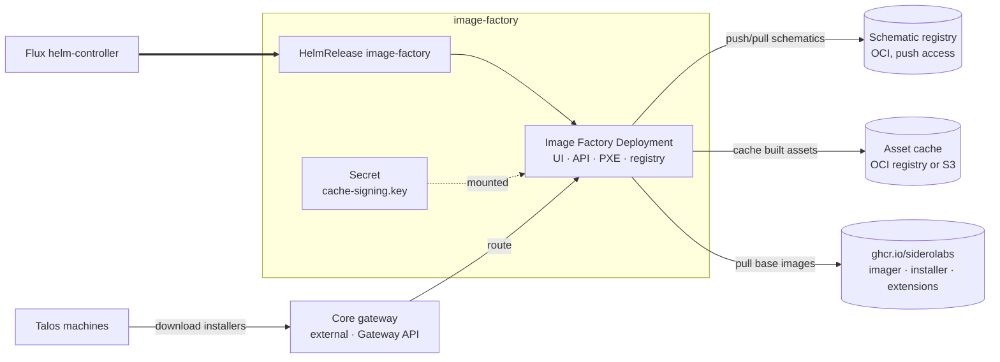

Provisions and manages downstream Talos clusters: the **image factory** builds boot
assets, and **Omni** is the control plane that provisions and manages the clusters.
Both are declared in `addon-provisioning.yaml`, each its own Flux Kustomization,
independently toggleable. `provisioning.image_factory.enabled` works alone, without Omni,
for a single cluster that just wants air-gapped Talos assets.

## Image Factory

Generates Talos boot assets (installers, ISOs, PXE artifacts) from schematics — the same
service as [factory.talos.dev](https://factory.talos.dev), hosted in the management
cluster. Pins what machines boot and builds images with system extensions, without
reaching the public factory.

Installs the Sidero Labs `image-factory` chart from `oci://ghcr.io/siderolabs/charts`. Hard
dependencies:

- **A schematic registry.** The operator supplies one; the chart's `registry.example.com`
  default fails at runtime, so this facet requires a real value.
- **A cache signing key.** Signs cached assets so nodes can verify them. `keys/signing`
  generates one (ECDSA P-256) by default; set `cache_signing_key` to supply your own.
  Rotating the key invalidates assets already signed with the old one.

### Architecture



### Routing

Reachable at `factory.<domain>` through Core's canonical `external` Gateway. One HTTPRoute
covers both envoy and cilium drivers, since both implement Gateway API. It waits on
`gateway-resources` so the listeners exist first.

### Scaling

Builds are CPU-bound. Three levers, in order:

1. **Cache.** Built once, served after. Bucket-backed on `hetzner`/`aws` (survives the
   pod); a PVC elsewhere. No cache makes builds feel slow.
2. **Concurrency.** `max_concurrency` (default 6) caps simultaneous builds. Raising it
   without node capacity just slows every build.
3. **Replicas.** `topology: ha` runs two, with anti-affinity. Redundancy against node
   loss, not zero-downtime (the chart uses Recreate). Safe because nothing is held
   locally.

## Omni

Sidero Labs' self-hosted fleet control plane for Talos: the system of record for every
downstream cluster's identity, and what an operator uses to provision and manage them.
Runs with embedded etcd, its own TLS, WireGuard-based SideroLink exposure, and SAML auth
against Core's Keycloak realm (Omni's OIDC path has no group/role claim mapping yet).

Installs the Sidero Labs `omni` chart from `oci://ghcr.io/siderolabs/charts`. Hard
dependencies:

- **An identity provider.** SAML, registered by an admin-API Job (`omni/saml-client`)
  against Core's platform Keycloak realm.
- **An etcd encryption key** outside dev mode, and **at least one bootstrap admin email**.
  The chart won't start without either — see `provisioning.omni.etcd_encryption_key` and
  `provisioning.omni.initial_admins`.
- **A gateway.** Omni's UI/API, Kubernetes proxy, and SideroLink machine API all reach
  Core's canonical `external` Gateway.

### Routing

Three HTTPRoutes on the shared gateway: API/UI, Kubernetes proxy, and SideroLink machine
API. SideroLink's own WireGuard exposure varies by load-balancer mode: a dedicated
NodePort or LoadBalancer Service on envoy or NodePort clusters, or a second Gateway
sharing the shared one's external IP (`omni/gateway/wireguard`) on cilium. Envoy doesn't
get the dedicated-Gateway path yet.

### Image factory integration

Omni's `config.registries.imageFactoryBaseURL` points at Manager's own image factory when
`provisioning.image_factory.enabled == true`, or the public `https://factory.talos.dev`
otherwise. Used both for Omni's own reconciliation and the download links it hands an
operator's browser.

## Configuration

<!-- BEGIN_KUSTOMIZE_DOCS -->

## Substitutions

| Name | Required when | Effect |
|---|---|---|
| `external_domain` | always | Domain the factory is served under; the hostname is `factory.<external_domain>`. Public domain when set, otherwise the private domain or the cluster domain. |
| `factory_schematic_registry` | always | OCI registry the factory pushes generated schematics to. Needs push access. Defaults to the registry capability (registry.driver, kustomize/registry/) unless provisioning.image_factory.registry.schematic.registry names an external one. |
| `factory_schematic_namespace` | optional | Repository path prefix for schematics. Defaults to `siderolabs/image-factory`. |
| `factory_schematic_repository` | optional | Repository name for schematics. Defaults to `schematics`. |
| `factory_schematic_insecure` | optional | Allow HTTP or invalid TLS to the schematic registry. Defaults to the registry capability's own posture (plain HTTP in-cluster). |
| `factory_max_concurrency` | optional | Simultaneous asset builds. Defaults to `6`; each build is CPU-bound, so raise it with the node pool rather than ahead of it. |
| `factory_min_talos_version` | optional | Oldest Talos release assets are generated for. Defaults to `1.2.0`. |
| `factory_installer_namespace` | optional | Repository path prefix for installer images. Empty for the distribution driver; `image-factory` for harbor. |
| `omni_account_id` | always | UUID for `config.account.id`, from `provisioning.omni.account_id` or the `omni-account` Terraform module's state. |
| `omni_hostname` | always | Base hostname Omni's UI/API advertises, from `provisioning.omni.hostname` or derived as `omni.<domain>`. |
| `omni_persistence_size` | always | Size of the volume backing Omni's embedded etcd, secondary SQLite storage, and machine logs. Defaults to `16Gi`. |
| `omni_wireguard_node_port` | `omni/nodeport` | NodePort for the WireGuard Service backing SideroLink. Chart default 30180. |
| `omni_wireguard_advertised_endpoint` | always | host:port machines dial for SideroLink, from `provisioning.omni.wireguard.advertised_endpoint` or derived from the compute module / cluster nodes. |
| `omni_initial_admins` | outside dev mode | Emails seeded as admins on Omni's first start, from `provisioning.omni.initial_admins`. |
| `keycloak_saml_url` | always | Identity's SAML descriptor URL Omni's chart fetches server-side at startup. |
| `keycloak_realm` | always | Identity realm Omni's SAML client registers against. |

## Components — `shared`

### `namespace`

_Enabled when always._

The `provisioning` Namespace and the shared `siderolabs` HelmRepository.

## Components — `image-factory`

### `registry`

_Enabled when no external schematic registry is named._

In-cluster OCI registry (`distribution`) holding schematics and cached boot assets. Reached at `registry.provisioning.svc.cluster.local:5000` over plain HTTP; no route, and a NetworkPolicy admits only the factory pod on 5000.

| Variant | Enabled when | Effect |
|---|---|---|
| `pvc` | `object_store.driver` is neither `hetzner` nor `aws` | Backs the registry with a volumeClaimTemplate on the default storage class, in place of its default emptyDir. Without it a restart loses every schematic id already handed out. |
| `s3` | `object_store.driver` is `hetzner` or `aws` | Backs the registry with a bucket from the platform's object store instead of a volume. Limited to the platforms the registry holds credentials for: Hetzner keys come from `hetzner.object_storage`, and on AWS an empty key pair leaves the S3 driver on the instance credential chain. A minio object store stays on a PVC until credentials for one exist. |

### `image-factory`

_Enabled when `provisioning.image_factory.enabled == true`._

Helm release of the Sidero Labs `image-factory` chart in `provisioning`, from `oci://ghcr.io/siderolabs/charts`. Serves the UI, API, and registry frontends on :8080. Runs as uid 1000, non-root, baseline PSA-compatible. The chart supports only the Recreate deployment strategy.

| Variant | Enabled when | Effect |
|---|---|---|
| `ha` | `topology == 'ha'` | Two replicas with pod anti-affinity across nodes. Redundancy against node loss only — the Recreate strategy means rollouts still have a gap. Safe because builds are stateless: schematics live in the registry, cached assets in the cache backend. |
| `prometheus` | `telemetry.metrics.enabled == true` | Metrics Service on :2122 plus a ServiceMonitor. Both are needed — the chart leaves the metrics Service off by default, so a ServiceMonitor alone would have nothing to scrape. |
| `gateway` | gateway is enabled | HTTPRoute on Core's canonical `external` Gateway, attached to both the web-http and web-https listeners. One route serves both gateway drivers, since envoy and cilium each implement Gateway API. Lives in the resources tier and depends on `gateway-resources`. |
| `harbor-auth` | the registry capability's driver is harbor | Mounts the dockerconfigjson Secret `harbor/image-factory` writes (kustomize/registry/) and points `DOCKER_CONFIG` at it, so the chart's own OCI client authenticates its pushes. |

## Components — `omni`

### `omni`

_Enabled when `provisioning.enabled == true`._

Helm release of the Sidero Labs `omni` chart in `provisioning`, from `oci://ghcr.io/siderolabs/charts`. The fleet's self-hosted Talos control plane — embedded etcd, own TLS, SideroLink, Keycloak SAML.

| Variant | Enabled when | Effect |
|---|---|---|
| `saml-client` | always | Job that registers Omni as a SAML client of the platform Keycloak realm over the admin REST API. |
| `prometheus` | `telemetry.metrics.enabled == true` | Metrics Service and ServiceMonitor for Omni's native metrics. |
| `nodeport` | NodePort load-balancer mode (e.g. docker-desktop) | Dedicated NodePort Service for SideroLink WireGuard. |
| `loadbalancer` | load-balancer mode and the gateway driver isn't cilium | Dedicated LoadBalancer Service for SideroLink WireGuard. |
| `exporter` | metrics are enabled and `provisioning.omni.service_account_key` is set | omni_exporter Deployment. Off until an admin creates the Reader-role service account by hand and hands the key to Windsor via a secret() reference. |
| `gateway` | always | HTTPRoutes on Core's canonical `external` Gateway for Omni's UI/API, Kubernetes proxy, and SideroLink machine API. Lives in the resources tier and depends on `gateway-resources`. |
| `gateway/wireguard` | cilium gateway driver and non-NodePort load-balancer mode | A dedicated Gateway sharing the shared gateway's external IP (Cilium `lbipam.cilium.io/sharing-key`) for SideroLink WireGuard, instead of a dedicated Service. |

## Dependencies

| Add-on | Required when | Reason |
|---|---|---|
| `provisioning-base` | always | The Namespace and HelmRepository both Kustomizations need are applied there, not in either one's own inventory. |
| `pki` | always | The factory is served over TLS, and the certificate is issued by the cluster issuer cert-manager installs. |
| `gateway` | `gateway.enabled == true` | The route CRDs have to exist before the chart renders an Ingress, HTTPRoute, or Gateway. |
| `identity` | always (omni) | Omni authenticates operators via SAML against Core's Keycloak realm. |

<!-- END_KUSTOMIZE_DOCS -->

## Recipes

Minimal image factory, using the public registries for base images and an internal registry
for schematics:

```yaml
provisioning:
  image_factory:
    enabled: true
    external_url: https://factory.example.com
    cache_signing_key: ${secret("Developer", "image-factory", "cache_signing_key")}
    registry:
      schematic:
        registry: registry.example.com
```

Bucket-backed image factory, with metrics and redundancy. On `hetzner` and `aws` the
registry moves to the platform's object store on its own — there is no cache driver to
select, and the bucket is provisioned by the object-store module:

```yaml
platform: aws
topology: ha
telemetry:
  metrics:
    enabled: true
aws:
  region: us-west-2
provisioning:
  image_factory:
    enabled: true
    external_url: https://factory.example.com
    cache_signing_key: ${secret("Developer", "image-factory", "cache_signing_key")}
```

Leaving `registry.schematic` unset is what turns on the in-cluster registry; naming an
external registry there disables it and the platform's object store goes unused.

Full provisioning — Omni plus the image factory it depends on:

```yaml
gateway:
  enabled: true
provisioning:
  enabled: true
  omni:
    hostname: omni.example.com
    etcd_encryption_key: ${secret("Developer", "omni", "etcd_encryption_key")}
    initial_admins:
      - admin@example.com
```

## Not covered yet

- **PXE.** The image factory exposes a separate PXE frontend (`ingress.pxe` /
  `gatewayApi.pxe`). Wiring it needs a second host and a network decision.
- **SecureBoot.** Needs a signing key, a certificate, and a PCR key or KMS backend —
  key-custody decisions this add-on doesn't make.
- **Air-gapped.** Running without `ghcr.io` means seeding base images and cosign material
  into an internal registry first. Harbor's problem, not this add-on's.
- **Downstream cluster lifecycle ownership.** How Omni and Cluster API coexist for
  provisioning clusters isn't decided yet.
